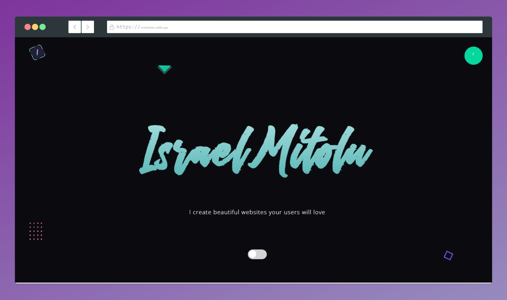

# Rajesh Portfolio

Personal portfolio website by Rajesh.

## Screenshot

## Live Site

After pushing to GitHub and enabling Pages, your site URL will be:

- `https://<your-github-username>.github.io/<your-repository-name>/`

If your repository name is `<your-github-username>.github.io`, then URL is:

- `https://<your-github-username>.github.io/`

## Tools

Built using HTML, CSS (SCSS), JavaScript, and GSAP.
